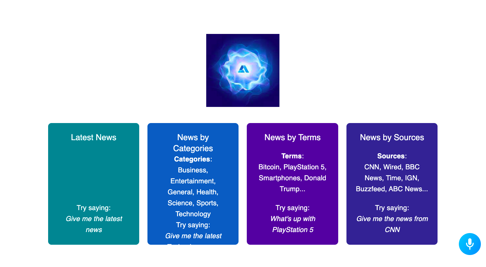

[LIVE APP](https://alan-ai-newz-app.netlify.app/)

# Artificial_Intelligence-powered_News_app
Implementation of Alan AI to help users get th elatest news on varios topics from various news bodies using voice requests.

INTRODUCTION
This is a code repository for the corresponding video tutorial.

In this video, we're going to build a Conversational Voice Controlled React News Application using Alan AI. Alan AI is a revolutionary speech recognition software that allows you to add voice capabilities to your applications. It allows you to control absolutely everything in the app using your voice. Another huge benefit is that it's extremely easy to integrate it. We'll do it together in this video and afterward, you'll be able to create your own voice-controlled apps.

Setup:

run yarn && yarn dev to start development server
